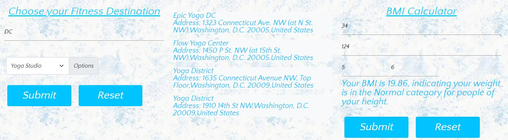

# Group Name: 
Wellness Finder
# Project Description: 
Wellness website that will search API's to find closest exercise classes and calculate their Body Mass Index (BMI). You will choose between four choices: Yoga Studio, Pilates studio, Gym, and Weight loss center. Next, the user will input their age, weight (lbs.), and height to calculate their Body Mass Index (BMI). We are hoping that the information we provide will be of use to the user's health. 
# Setup/ Installation requirements
1- Click on website at bottom of README.md
2- Scroll down and enter information for Wellness Place Finder. Click submit. 
3- Enter information for BMI calculator. Click submit. 
# Technologies used:
API 1: Foursquare Venue Search
API 2: Rapid API's BMI Calculator
Html
CSS
Bootstrap
Materialize
Google fonts
React
Javascript
JQuery
Epidemic sounds
# Known bugs
There are no known bugs
# Project Mockup:

# Team members and responsibilities:
Hanna: Group leader, Postman, Javascript, Foursquare API
Menuka: html, Material UI, CSS, music
Mengyue: Javascript, BMI API, JQuery, CSS, mockup
Kyle: API research, Postman, html, Presentation, README
# Website Screenshot

# Website Deployment links
Repository : https://github.com/kinziva/Project1G4
Application : https://kinziva.github.io/Project1G4/

